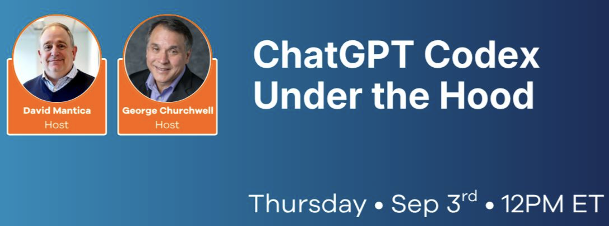
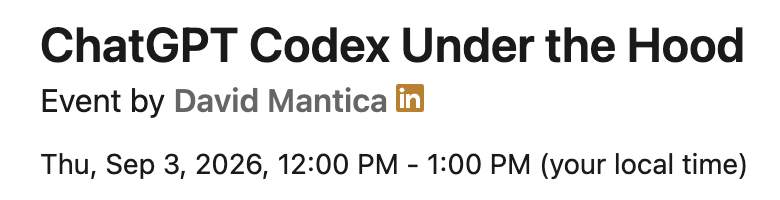

# ChatGPT Codex Under the Hood

## Details

- **Event:** <https://www.linkedin.com/events/7497622989929316352/>
- **Summary:** George and David will discuss all things ChatGPT Codex, from there George will get "under the hood" and showcase some demos.

## People

- **George Churchwell** (Presenter).  Rambled.  Was focused (kinda) by David.
- **David Mantica** (Host)
- Chris Casey
- Maria Kolenda - <https://www.linkedin.com/in/maria-a-kolenda-pmp-cspo-caf-cal-1-aa0927b/>
  - Sent LI connection request

- Nelson Daramola - <https://www.linkedin.com/in/nelson-daramola04/>
  - Sent LI connection request
  - Commented on his LI post
  - Commented on his blog post

## Notes

### Sessions

### Key Takeaways

### Follow-up

## References

Casey, C. (n.d.). Markdown as a token-efficiency layer for enterprise GenAI. Retrieved from <https://criscasey.com/markdown-token-efficiency-strategy-for-enterprise-genai/>

**Summary:** Converting documents to Markdown before submitting to generative AI reduces token consumption by eliminating format extraction overhead. Markdown's explicit hierarchy saves 30,000-45,000 tokens per document compared to model-directed conversion.
